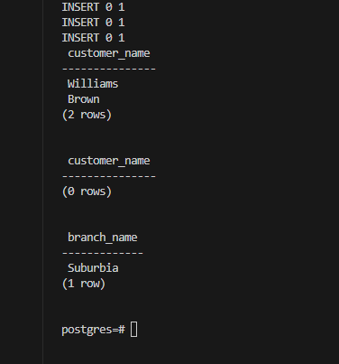

# DSC_E3.8

Consider the bank database of Figure 3.19, where the primary keys are underlined. Construct the following SQL queries for this relational database.

--  a. Find all customers of the bank who have an account but not a loan.

SELECT DISTINCT d.customer_name
FROM depositor d
WHERE d.customer_name NOT IN (
    SELECT b.customer_name
    FROM borrower b
);

-- b. Find the names of all customers who live on the same street and in the same city as “Smith”.

SELECT DISTINCT c.customer_name
FROM customer c
WHERE c.customer_street = (
    SELECT customer_street
    FROM customer
    WHERE customer_name = 'Smith'
)
AND c.customer_city = (
    SELECT customer_city
    FROM customer
    WHERE customer_name = 'Smith'
)
AND c.customer_name != 'Smith';

-- c. Find the names of all branches with customers who have an account in the bank and who live in “Harrison”.

SELECT DISTINCT a.branch_name
FROM account a
JOIN depositor d ON a.account_number = d.account_number
JOIN customer c ON d.customer_name = c.customer_name
WHERE c.customer_city = 'Harrison';

